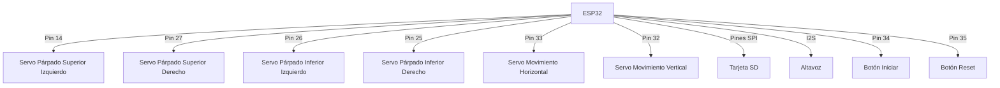

# Proyecto Ojos de Dobby

## Descripción General

Este proyecto utiliza un ESP32 para controlar los ojos animatrónicos de Dobby, un personaje de Harry Potter. Los ojos pueden moverse en diferentes direcciones, parpadear, y el dispositivo puede reproducir sonidos. El proyecto también incluye funciones de bajo consumo y actualización inalámbrica (OTA).

## Componentes Principales

1. ESP32 (microcontrolador)
2. 6 servomotores (para movimiento de ojos y párpados)
3. Tarjeta SD (para almacenar archivos de audio)
4. Altavoz (para reproducir sonidos)
5. Botones (para iniciar y reiniciar)

## Diagrama de Conexión Simplificado



## Funciones Principales

### 1. Configuración Inicial (setup)

Esta función se ejecuta una vez al inicio y configura todo lo necesario:
- Inicia la comunicación serial
- Configura la tarjeta SD y el sistema de audio
- Configura los servomotores
- Prepara el sistema para actualizaciones OTA (si está habilitado)
- Configura los botones y el modo de bajo consumo

### 2. Bucle Principal (loop)

Esta función se ejecuta continuamente y controla el comportamiento de los ojos:
- Maneja actualizaciones OTA (si están habilitadas)
- Verifica si es hora de entrar en modo de bajo consumo
- Controla la reproducción de audio
- Ejecuta una secuencia de movimientos de ojos

### 3. Control de Párpados

- `abrirParpados()`: Abre todos los párpados
- `cerrarParpados()`: Cierra todos los párpados
- `guinarOjoIzquierdo()`: Guiña el ojo izquierdo
- `guinarOjoDerecho()`: Guiña el ojo derecho

### 4. Movimiento de Ojos

- `mirarArriba()`: Mueve ambos ojos hacia arriba
- `mirarAbajo()`: Mueve ambos ojos hacia abajo
- `mirarIzquierda()`: Mueve ambos ojos hacia la izquierda
- `mirarDerecha()`: Mueve ambos ojos hacia la derecha
- `mirarCentro()`: Centra ambos ojos
- `movimientoCircularHorario()`: Mueve los ojos en círculo en sentido horario
- `movimientoCircularAntihorario()`: Mueve los ojos en círculo en sentido antihorario

### 5. Reproducción de Audio

- `reproducirAudio(ruta)`: Reproduce un archivo de audio específico
- `reproducirRespuestaAleatoria()`: Reproduce una respuesta de audio aleatoria
- `reproducirIntroduccion()`: Reproduce el audio de introducción

### 6. Gestión de Energía

- `entrarModoSueno()`: Pone el dispositivo en modo de bajo consumo

### 7. Actualización OTA (Over The Air)

- `initOTA()`: Configura y prepara el sistema para actualizaciones inalámbricas

## Cómo Funciona

1. Al encenderse, el sistema configura todos los componentes.
2. Entra en un bucle donde realiza una secuencia de movimientos de ojos y reproducción de audio.
3. Si no hay actividad por un tiempo, entra en modo de bajo consumo.
4. El sistema puede ser actualizado inalámbricamente si la función OTA está habilitada.

## Personalización

Puedes modificar varios aspectos del comportamiento:
- Ajustar los ángulos de movimiento de los servos
- Cambiar la secuencia de movimientos en el bucle principal
- Agregar nuevos archivos de audio a la tarjeta SD
- Modificar los tiempos de espera para el modo de bajo consumo

# Explicación Detallada del Código de Ojos de Dobby

## Índice
1. [Configuración Inicial](#configuración-inicial)
2. [Bucle Principal](#bucle-principal)
3. [Funciones de Control de Párpados](#funciones-de-control-de-párpados)
4. [Funciones de Movimiento de Ojos](#funciones-de-movimiento-de-ojos)
5. [Funciones de Audio](#funciones-de-audio)
6. [Gestión de Energía](#gestión-de-energía)
7. [Actualización OTA](#actualización-ota)

## Configuración Inicial

```cpp
void setup() {
  Serial.begin(115200);
  Serial.println(version);
  if (OTAhabilitado) initOTA();
  
  if (!SD.begin(CS)) {
    Serial.println("Tarjeta SD no encontrada");
    return;
  }
  
  mp3 = new AudioGeneratorMP3();
  salida = new AudioOutputI2SNoDAC();
  fuente = new AudioFileSourceSD();
  
  salida->SetOutputModeMono(true);
  
  pinMode(PIN_BOTON_INICIAR, INPUT_PULLUP);
  pinMode(PIN_BOTON_RESET, INPUT_PULLUP);
  
  esp_sleep_enable_ext0_wakeup((gpio_num_t)PIN_BOTON_INICIAR, LOW);

  servo1.attach(servoPin1, 500, 2400);
  servo2.attach(servoPin2, 500, 2400);
  servo3.attach(servoPin3, 500, 2400);
  servo4.attach(servoPin4, 500, 2400);
  servo5.attach(servoPin5, 500, 2400);
  servo6.attach(servoPin6, 500, 2400);
  
  delay(1000);
  TodosCentro();
  delay(1000);
  
  ultimaActividad = millis();
}
```

### Explicación:
- Inicia la comunicación serial a 115200 baudios.
- Si OTA está habilitado, inicializa la configuración OTA.
- Intenta iniciar la tarjeta SD. Si falla, muestra un mensaje de error.
- Crea instancias para el manejo de audio MP3.
- Configura la salida de audio en modo mono.
- Configura los pines de los botones como entradas con pull-up.
- Configura el modo de despertar del sueño profundo.
- Adjunta los servomotores a sus pines correspondientes, especificando los valores mínimos y máximos de pulso.
- Llama a la función `TodosCentro()` para posicionar todos los servos en su posición central.
- Inicializa `ultimaActividad` con el tiempo actual.

## Bucle Principal

```cpp
void loop() {
  OTAhabilitado ? ArduinoOTA.handle() : yield();
  yield();
   
  if (digitalRead(PIN_BOTON_RESET) == LOW) {
    ESP.restart();
  }
  
  if (millis() - ultimaActividad > TIEMPO_ANTES_DE_DORMIR) {
    if (!mp3->isRunning()) {
      entrarModoSueno();
    }
  }

  if (mp3->isRunning()) {
    if (!mp3->loop()) {
      mp3->stop();
      fuente->close();
      Serial.println("Audio Stop");
      Serial.println("Archivo Cerrado");
      yield();
    }
  } else {
    // Secuencia de movimientos de ojos
    abrirParpados();
    delay(2000);
    mirarDerecha();
    delay(2000);
    mirarCentro();
    delay(2000);
    mirarIzquierda();
    delay(2000);
    mirarCentro();
    guinarOjoDerecho();
    delay(2000);
    mirarArriba();
    delay(2000);
    mirarAbajo();
    delay(1000);
    mirarCentro();
    delay(1000);
    cerrarParpados();
    
    ultimaActividad = millis();
    
    if (millis() - ultimaActividad > TIEMPO_Entre_Audios) {
      if (!mp3->isRunning()) {
        reproducirRespuestaAleatoria();
      }
    }
  }
}
```

### Explicación:
- Maneja las actualizaciones OTA si están habilitadas.
- Verifica si se presionó el botón de reinicio.
- Comprueba si es hora de entrar en modo de sueño.
- Si se está reproduciendo audio, maneja su finalización.
- Si no se está reproduciendo audio, realiza una secuencia de movimientos de ojos.
- Actualiza `ultimaActividad` después de los movimientos.
- Verifica si es hora de reproducir un audio aleatorio.

## Funciones de Control de Párpados

```cpp
void abrirParpados() {
  servo1.write(centroParpadoSupIzq - recorridoParpadoSupIzq);
  servo3.write(centroParpadoInfIzq + recorridoParpadoInfIzq);
  servo2.write(centroParpadoSupDer + recorridoParpadoSupDer);
  servo4.write(centroParpadoInfDer - recorridoParpadoInfDer);
}

void cerrarParpados() {
  servo1.write(centroParpadoSupIzq);
  servo3.write(centroParpadoInfIzq);
  servo2.write(centroParpadoSupDer);
  servo4.write(centroParpadoInfDer);
}

void guinarOjoIzquierdo() {
  servo1.write(centroParpadoInfIzq);
  servo3.write(centroParpadoInfIzq);
  delay(200);
  servo1.write(centroParpadoSupIzq - recorridoParpadoSupIzq);
  servo3.write(centroParpadoInfIzq + recorridoParpadoInfIzq);
}

void guinarOjoDerecho() {
  servo2.write(centroParpadoSupDer);
  servo4.write(centroParpadoInfDer);
  delay(200);
  servo2.write(centroParpadoSupDer + recorridoParpadoSupDer);
  servo4.write(centroParpadoInfDer - recorridoParpadoInfDer);
}
```

### Explicación:
- `abrirParpados()`: Mueve los servos de los párpados a sus posiciones de "abierto".
- `cerrarParpados()`: Mueve los servos de los párpados a sus posiciones de "cerrado".
- `guinarOjoIzquierdo()`: Cierra y abre rápidamente el ojo izquierdo.
- `guinarOjoDerecho()`: Cierra y abre rápidamente el ojo derecho.

## Funciones de Movimiento de Ojos

```cpp
void mirarArriba() {
  servo6.write(centroVertical - recorridoVertical);
}

void mirarAbajo() {
  servo6.write(centroVertical + recorridoVertical);
}

void mirarIzquierda() {
  servo5.write(centroHorizontal + recorridoHorizontal);
}

void mirarDerecha() {
  servo5.write(centroHorizontal - recorridoHorizontal);
}

void mirarCentro() {
  mirarCentroHorizontal();
  mirarCentroVertical();
}

void movimientoCircularHorario() {
  for (int i = 0; i <= recorridoHorizontal; i++) {
    servo5.write(centroHorizontal + i);
    delay(50);
  }
  // ... (código similar para los otros lados del círculo)
}
```

### Explicación:
- Cada función mueve los servos correspondientes para lograr el movimiento deseado.
- `mirarCentro()` combina los movimientos horizontal y vertical para centrar los ojos.
- `movimientoCircularHorario()` mueve los ojos en un patrón circular usando bucles for.

## Funciones de Audio

```cpp
void reproducirAudio(const char *ruta) {
  if (!SD.exists(ruta)) {
    Serial.println("Archivo no encontrado");
    return;
  }

  if (!fuente->open(ruta)) {
    Serial.println("Error al abrir el archivo");
    return;
  }

  yield();
  mp3->begin(fuente, salida);
}

void reproducirRespuestaAleatoria() {
  char ruta[15];
  int numeroRespuesta = random(1, totalRespuestasAleatorias);
  snprintf(ruta, sizeof(ruta), "/resp%d.mp3", numeroRespuesta);
  Serial.print("Aleatoria: ");
  Serial.println(ruta);
  reproducirAudio(ruta);
}
```

### Explicación:
- `reproducirAudio()`: Verifica si el archivo existe, lo abre e inicia la reproducción.
- `reproducirRespuestaAleatoria()`: Selecciona un archivo de audio aleatorio y lo reproduce.

## Gestión de Energía

```cpp
void entrarModoSueno() {
  Serial.println("Entrando en modo sueño...");
  cerrarParpados();
  delay(1000);
  esp_deep_sleep_start();
}
```

### Explicación:
- Imprime un mensaje, cierra los párpados y pone el ESP32 en modo de sueño profundo.

## Actualización OTA

```cpp
void initOTA() {
  WiFi.mode(WIFI_STA);
  WiFi.begin(ssid, password);
  while (WiFi.status() != WL_CONNECTED) {
    delay(500);
    Serial.println("Conectando a WiFi...");
  }
  Serial.println("Conectado a la red WiFi");
  
  ArduinoOTA.setHostname("OjosDobby");
  ArduinoOTA.setPassword("O");
  
  ArduinoOTA.onStart([]() {
    String tipo;
    if (ArduinoOTA.getCommand() == U_FLASH) {
      tipo = "sketch";
    } else {
      tipo = "filesystem";
    }
    Serial.println("Inicio de actualización OTA: " + tipo);
  });
  
  // ... (más configuraciones de eventos OTA)

  ArduinoOTA.begin();
  Serial.println("Listo para actualización OTA");
  Serial.print("IP address: ");
  Serial.println(WiFi.localIP());
}
```

### Explicación:
- Configura la conexión WiFi.
- Establece el nombre de host y la contraseña para OTA.
- Configura los manejadores de eventos para diferentes etapas de la actualización OTA.
- Inicia el servicio OTA y muestra la dirección IP del dispositivo.

Este archivo proporciona una explicación detallada de cada función principal en el código de los Ojos de Dobby. Ayudará a los estudiantes a comprender cómo funciona cada parte del programa y cómo interactúan entre sí.

